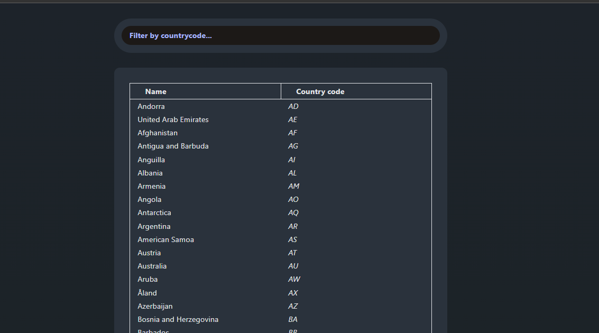

# Countries Filtering Table

## About 
This project is a React application that fetches data from a GraphQL API and displays it in a table. Users can filter the table based on country codes. 
Main tools used here are: 
- React Query for data fetching and caching
- React Table for displaying tabular data
- Tailwind for styling
- Typescript for type safetly
- Notistack library for displaying notifications for the user

### Main Table View

### Notistack notifications

## Setup Instructions
- Clone the project
- Install packages `npm i`
- Run the local server `npm run dev`
- Open browser at `http://localhost:5173/`
- To run tests: `npm test`

